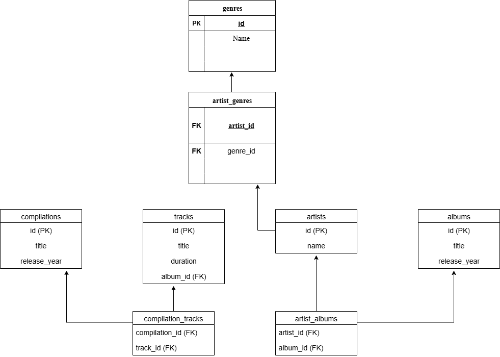

# Music Service Database

База данных для музыкального стримингового сервиса.

## Структура БД

- genres - музыкальные жанры
- artists - исполнители
- albums - альбомы
- tracks - треки
- compilations - сборники

## Схема базы данных

## Установка

Выполните SQL-запросы из файла music_service_database.sql